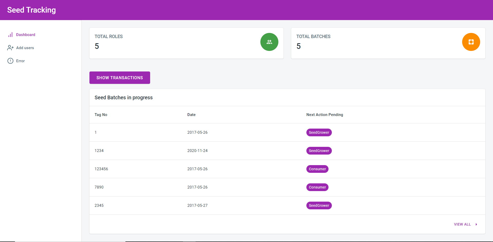
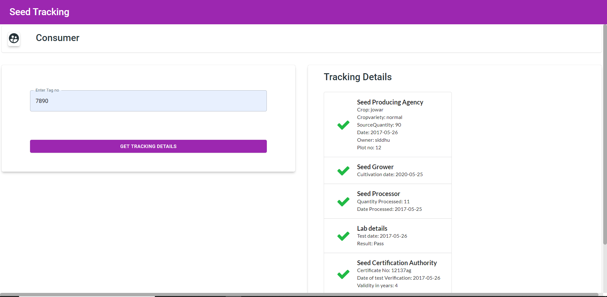
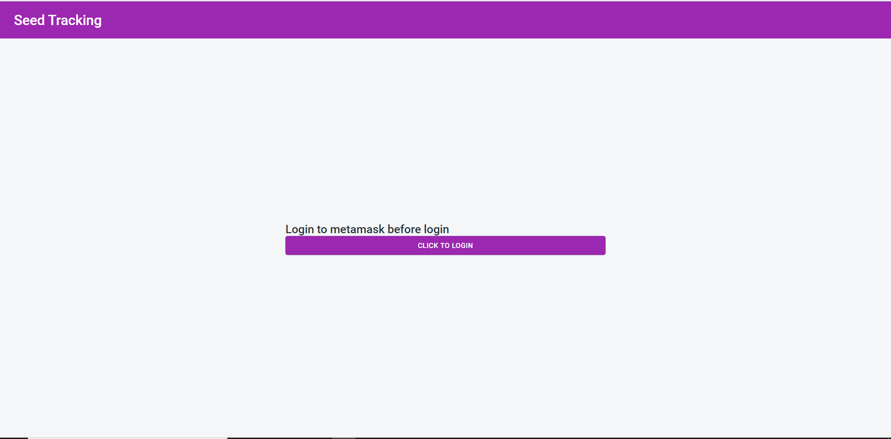
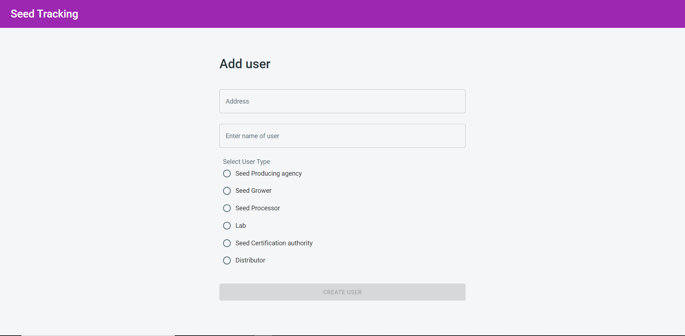
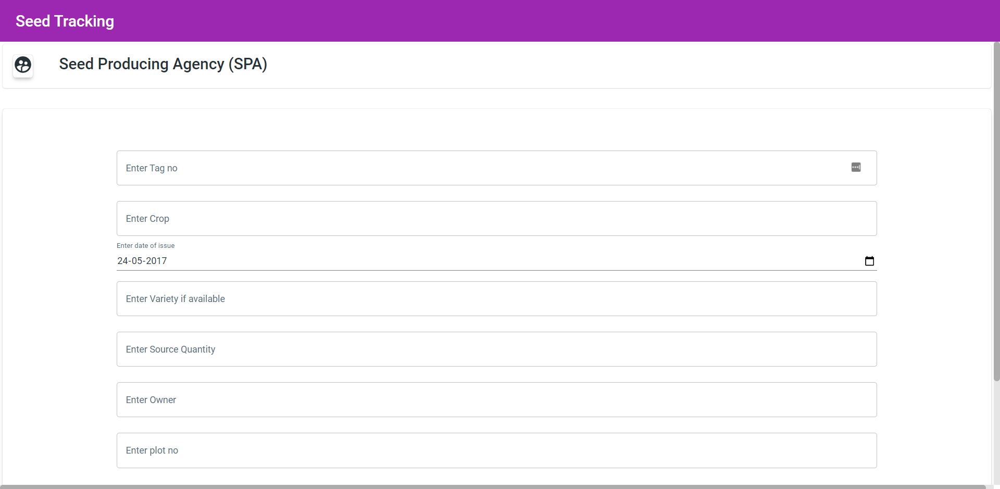
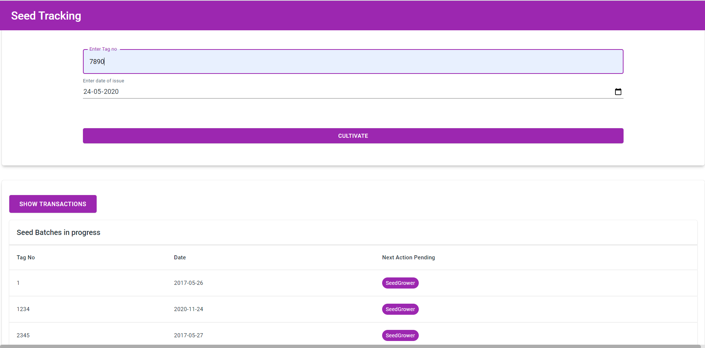
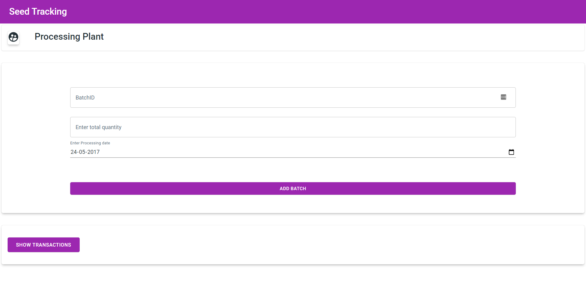
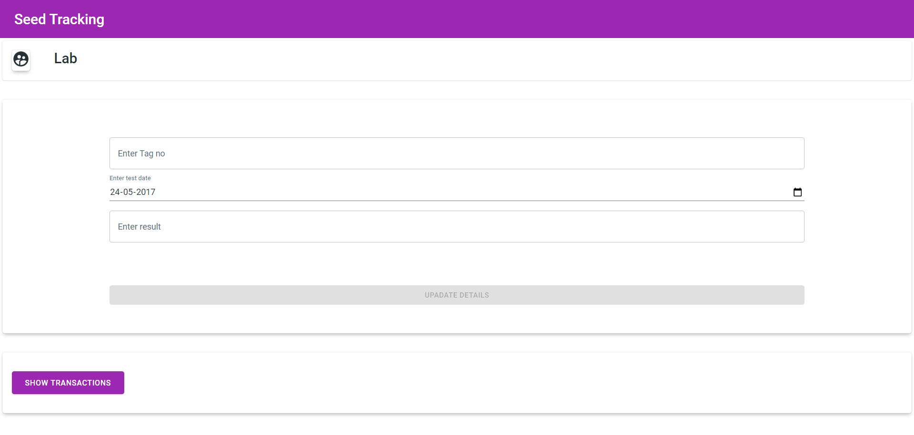
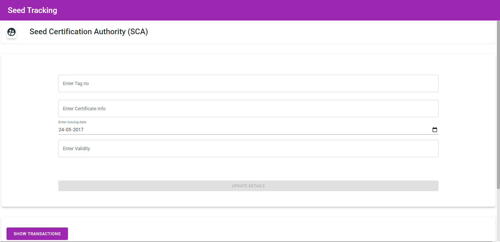
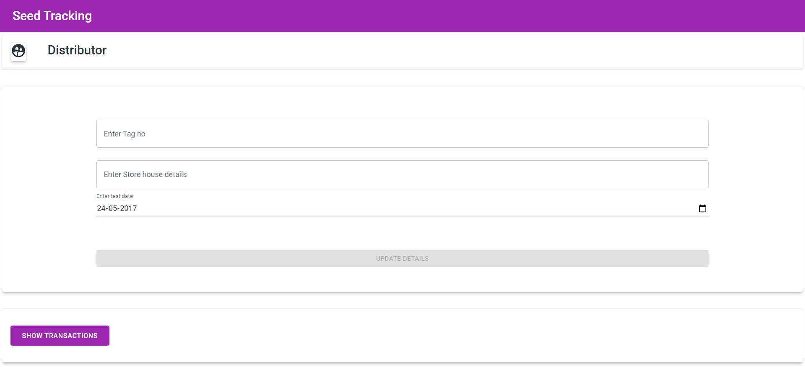

# Seed Tracking System using smart contract

This project helps farmers/consumers to get tracking about how the seed was processed and other details such Certification, Lab results,
Date and other information. The following stakeholders are involved
- Seed Producing Agency(SPA)
- Seed Grower
- Seed Processor
- Lab for testing
- Seed Certification Agency
- Distributor

## Technology used
- React.js for UI
- Material UI
- Web3.js
- Truffle
- Metamask wallet
- Solidity
- Ganache

## Installation

#Install Truffle
#Install Ganache
-check port number mentioned in file truffle-config.js is same as ganache is running on.
# Deploying smart contract
Clone smart contract repository for this porject
```git clone https://github.com/codenikhil1/seedCertification_backend.git```
The code above has been contributed by ***codenikhil1*** as this is Duo Project.

Then run the below command
```truffle migrate --reset```
Then Copy contract address of seedSupply contract

# After above steps 
-Clone Front-End from ```https://github.com/siddhu890/seed-tracking-blockchain

- In src/contract.js add contract address to connect as given below
  ```javascript
     import web3 from './web3';
     const address =" paste contract address here ";
  ```
- Paste the ABI from truffle project build/seed.json and paste as given below
  ```javascript
     const abi = " paste abi here "
  ```
- Then
  ```npm start```
  
## Following are the development screens

### Admin
This page consiste of insights of batch added and their progress and also privilege to add stakeholders in the process.
```/app/dashboard```

---


### Consumer
This page consist field to enter tagno which is important for tracking and click to get tracking info
```/consumer```

---


### Login
The user must be logged in metamask login and then click on login for further process.
```/login```

---


### Registration
This page consist of fields to add user
```/registration```

---


### Seed Producing Agency (SPA)
```/SPA```

---


### Seed Grower (SG)
```/SG```

---


### Seed Processor
```/SP```

---


### Lab
```/lab```

---


### Seed Certification Authority (SCA)
```/SCA```

---


### Distributor
```/distributor```

---


# Further improvements 
- Add QR code for Batch in process so can be tracked by QR.
- More fields and stakeholders can be added.
- Local language support. eg Marathi, Hindi etc.


